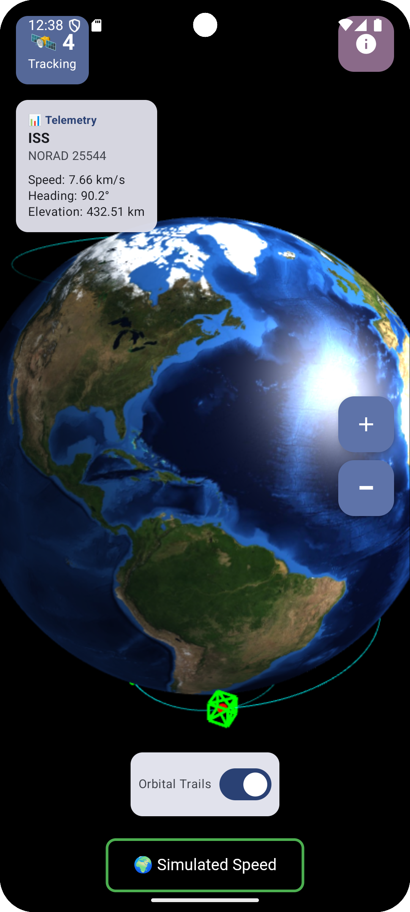
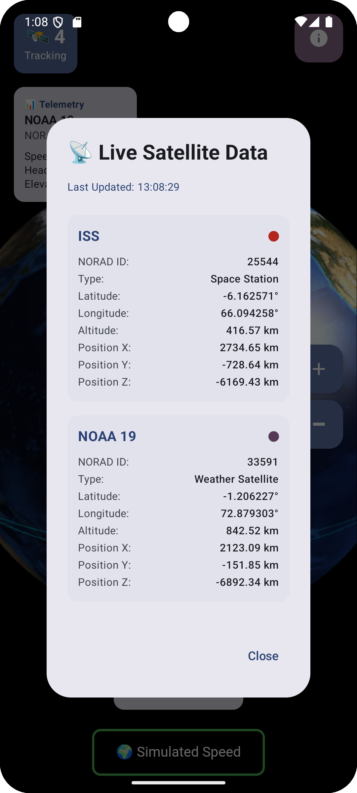
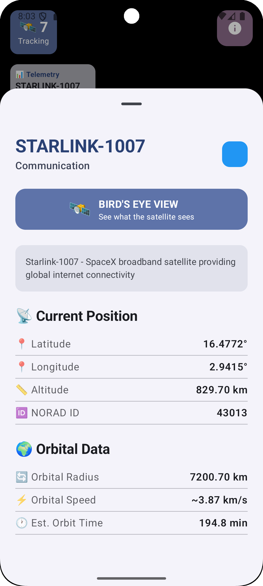
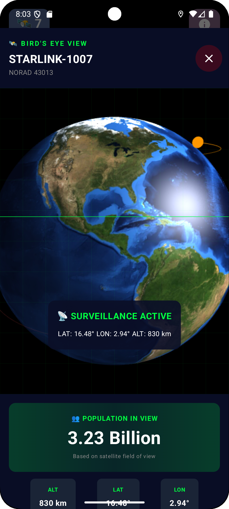

# Satellite Tracker - Native Android App 🛰️🌍📱

**A native Android application** featuring real-time satellite tracking with an interactive 3D Earth globe powered by Three.js and WebGL. Watch 9 satellites orbit Earth in real-time with beautiful orbital trail visualization.

> **Platform:** Android (Kotlin + Jetpack Compose)  
> **Minimum Android Version:** 8.1 Oreo (API 27)  
> **Target:** Android 14+ (API 36)

## 📸 Screenshots

<div align="center">
  
  <p><i>Native Android app - Real-time satellite tracking with 3D Earth globe</i></p>
</div>

<div align="center">
  
  
  <p><i>Left: Orbital trails visualization | Right: Auto-cycling telemetry display</i></p>
</div>

<div align="center">
  
  
  <p><i>Left: Bird's Eye View - See what the satellite sees | Right: Detailed satellite information panel</i></p>
</div>

## 📱 About This Android App

This is a **native Android application** built with modern Android development tools:
- Developed in **Kotlin** using **Jetpack Compose** for UI
- Runs on Android phones and tablets (API 27+)
- Requires **Android Studio** to build and run
- Uses WebView to embed Three.js for 3D rendering
- Designed for Android devices with internet connectivity

## ✨ Features

### Real-Time Tracking
- **9 Live Satellites**: ISS, NOAA 19, GPS BIIF-1, Starlink-1007, Hubble, Tiangong, Terra, Aqua, and Sentinel-6
- **Live Position Updates**: Fetches real-time satellite positions from the N2YO API every 10 seconds
- **Auto-Cycling Telemetry**: Automatically displays telemetry data for each satellite (5 seconds each), with manual override on click

### 🎯 NEW: AR Satellite Finder (Augmented Reality Mode)
- **📷 Live Camera Overlay**: Point your phone at the sky to see satellites overlaid on your camera view in real-time
- **🧭 Compass Integration**: Auto-aligns satellite positions with your device orientation using accelerometer and magnetometer sensors
- **📍 GPS Location Tracking**: Uses your precise location to calculate which satellites are visible from your position
- **🔔 Visibility Alerts**: Automatic notifications when ISS or other bright satellites pass overhead
- **Interactive AR Markers**: Color-coded satellite markers with crosshairs and altitude labels
- **Compass HUD**: Real-time azimuth and elevation display showing your viewing direction

### Interactive 3D Visualization
- **Photorealistic Earth**: High-quality Blue Marble Earth texture for stunning realism
- **Orbital Trail Rendering**: Configurable orbital trails (130 steps) showing satellite paths with gradient fade effects
- **Interactive Globe**: Smooth rotation, zoom controls, and satellite click detection
- **Satellite Highlighting**: Green wireframe box highlights selected satellites
- **Toggle Controls**: Easy on/off toggle for orbital trails
- **Dual View Modes**: Switch between 3D Globe View and AR Camera View with a single toggle

### Advanced UI/UX
- **MVVM Architecture**: Clean separation with ViewModel and Repository pattern
- **Jetpack Compose**: Modern declarative UI with Material Design 3
- **Telemetry HUD**: Real-time speed, heading, and elevation data for each satellite
- **Detailed Satellite Info**: Bottom sheet with comprehensive orbital data and descriptions
- **Responsive Design**: Optimized layout with floating action buttons and smart positioning

## 🚀 Technology Stack

### Frontend
- **Kotlin** - Modern, concise Android development
- **Jetpack Compose** - Declarative UI framework with Material Design 3
- **WebView Integration** - Seamless Android-JavaScript bridge for 3D rendering
- **CameraX** - Modern camera API for AR view with lifecycle-aware components

### AR & Sensors
- **Android Sensors API** - Accelerometer and magnetometer for device orientation
- **Google Play Services Location** - High-accuracy GPS positioning
- **Notification Manager** - Smart alerts for visible satellite passes
- **Real-time AR Calculations** - Azimuth, elevation, and screen position mapping

### 3D Rendering Engine
- **Three.js r128** - Industry-standard WebGL 3D library
- **Custom Shaders** - Phong material with specular highlights and emissive lighting
- **Raycasting** - Precise click detection on 3D satellite meshes
- **Dynamic Scene Updates** - Real-time satellite position updates without page reloads

### Backend & Data
- **Retrofit2** - Type-safe HTTP client for API communication
- **Moshi** - Fast JSON parsing with Kotlin reflection
- **Kotlin Coroutines** - Efficient asynchronous programming
- **N2YO API** - Professional satellite tracking data source

### Architecture
- **MVVM Pattern** - Model-View-ViewModel for clean architecture
- **Repository Pattern** - Centralized data management
- **LiveData/State** - Reactive state management with Compose
- **Coordinate Transformation** - Geographic to Cartesian conversion for 3D positioning

## 🎯 Key Capabilities

### AR Satellite Finder
- **Real-time AR Overlay**: Point your phone at the sky and see satellites marked in your camera view
- **Automatic Position Calculation**: Computes azimuth and elevation angles to each satellite based on your GPS location
- **Field of View Filtering**: Only shows satellites within your camera's field of view (90° horizontal, 60° vertical)
- **Color-Coded Markers**: ISS (Red), NOAA 19 (Green), Others (Yellow) with crosshair targeting reticles
- **Compass Integration**: Live azimuth display with cardinal directions (N, NE, E, SE, S, SW, W, NW)
- **Elevation Tracking**: Shows your phone's tilt angle for looking up at the sky

### Visibility Notifications
- **Smart Detection**: Automatically calculates which satellites are above your horizon
- **Distance Calculation**: Uses Haversine formula to compute satellite distance from your location
- **Elevation Threshold**: Only alerts for satellites above 10° elevation (visible above horizon)
- **Range Filtering**: Focuses on satellites within 2000 km for optimal visibility
- **ISS Priority Alerts**: Special high-priority notifications when the International Space Station passes overhead

### Satellite Click & Selection
- Click any satellite on the globe to view detailed information
- Green highlight box tracks selected satellite
- Manual selection pauses auto-cycling telemetry
- Bottom sheet displays full orbital data and satellite description

### Orbital Trail System
- 130-step trail calculation using orbital mechanics
- Gradient opacity fading from satellite to trail end
- Real-time redraw on configuration changes
- Individual trail rendering per satellite with color coding

### Real-Time Data Processing
- Parallel API requests for all 9 satellites
- Lat/Lon/Alt to Cartesian (X/Y/Z) coordinate conversion
- Orbital speed and heading calculations
- 10-second refresh interval for live tracking

## 📦 Setup Instructions

### 1. Get N2YO API Key

1. Visit [N2YO.com](https://www.n2yo.com/api/)
2. Sign up for a free account
3. Generate an API key

### 2. Configure the API Key (Secure Method)

**Important:** The API key is stored securely in `local.properties` which is **NOT** tracked by Git.

1. Open the file: `local.properties` (in the root project directory)
2. Add your API key at the bottom of the file:
   ```
   N2YO_API_KEY=YOUR_API_KEY_HERE
   ```
3. Save the file

**Note:** Your API key will never be committed to version control as `local.properties` is in `.gitignore`.

### 3. Grant Required Permissions

When you first run the app, you'll be prompted to grant:
- **Camera Permission** - Required for AR satellite finder view
- **Location Permission** - Required to calculate visible satellites from your position
- **Notification Permission** (Android 13+) - For visibility alerts when satellites pass overhead

### 4. Build and Run

1. Open the project in Android Studio
2. Sync Gradle files (dependencies will auto-download)
3. Connect an Android device or start an emulator (API level 27+)
4. Click "Run" or press Shift+F10

## 🎮 How to Use AR Mode

1. **Enable Location Services** on your device
2. **Grant Camera and Location permissions** when prompted
3. **Toggle AR Mode** using the switch at the bottom of the screen (🌍 Globe View ↔ 📷 AR Camera View)
4. **Point your phone at the sky** - satellites will appear as colored markers with crosshairs
5. **Move your phone around** - the compass and sensor integration will auto-align the satellite positions
6. **Look for notifications** - you'll be alerted when satellites like the ISS are visible overhead

## 🏗️ Project Structure

```
app/src/main/java/com/example/sat_trak/
├── MainActivity.kt                          # App entry point
├── data/
│   ├── api/
│   │   └── N2YOApiService.kt               # Retrofit API interface
│   ├── models/
│   │   ├── SatelliteModels.kt              # Satellite data models
│   │   └── ContinentModels.kt              # Geographic data models
│   └── repository/
│       ├── SatelliteRepository.kt          # Satellite data layer
│       └── ContinentDataLoader.kt          # Continent data loader
├── ui/
│   ├── components/
│   │   ├── GlobeWebView.kt                 # 3D globe WebView with Three.js
│   │   └── ARCameraView.kt                 # AR camera overlay with satellite markers
│   ├── screens/
│   │   └── MainScreen.kt                   # Main UI composable with view mode toggle
│   ├── theme/
│   │   ├── Color.kt                        # Material theme colors
│   │   ├── Theme.kt                        # Theme configuration
│   │   └── Type.kt                         # Typography definitions
│   └── viewmodel/
│       └── SatelliteViewModel.kt           # Business logic & state with location tracking
├── sensors/
│   └── OrientationSensorManager.kt         # Compass and accelerometer integration
├── location/
│   └── LocationProvider.kt                 # GPS location services
└── notifications/
    └── SatelliteNotificationManager.kt     # Visibility alert system
```

## 🌐 Tracked Satellites

1. **ISS (25544)** - International Space Station
   - Type: Space Station
   - Color: Red
   - Orbit: Low Earth Orbit (~400 km)

2. **NOAA 19 (33591)** - Weather Satellite
   - Type: Environmental Monitoring
   - Color: Green
   - Orbit: Polar Sun-synchronous

3. **GPS BIIF-1 (36585)** - Navigation Satellite
   - Type: GPS Constellation
   - Color: Yellow
   - Orbit: Medium Earth Orbit (~20,200 km)

4. **STARLINK-1007 (43013)** - Communication Satellite
   - Type: Internet Constellation
   - Color: Yellow
   - Orbit: Low Earth Orbit (~550 km)

5. **HUBBLE (37820)** - Space Telescope
   - Type: Space Observatory
   - Color: Yellow
   - Orbit: Low Earth Orbit (~540 km)

6. **TIANGONG (48274)** - Chinese Space Station
   - Type: Space Station
   - Color: Yellow
   - Orbit: Low Earth Orbit (~370-390 km)

7. **TERRA (25994)** - Earth Observation
   - Type: Climate & Weather
   - Color: Yellow
   - Orbit: Polar Sun-synchronous (~705 km)

8. **AQUA (27424)** - Earth Observation
   - Type: Water Cycle Monitoring
   - Color: Yellow
   - Orbit: Polar Sun-synchronous (~705 km)

9. **SENTINEL-6 (41765)** - Ocean Topography
   - Type: Ocean Monitoring
   - Color: Yellow
   - Orbit: Low Earth Orbit (~1,336 km)

## 📊 How It Works

### Data Flow
```
N2YO API → Repository → ViewModel → Compose UI → WebView → Three.js Rendering
    ↑                                                              ↓
    └──────────────── 10-second update cycle ─────────────────────┘
```

### Coordinate Transformation
Geographic coordinates are converted to 3D Cartesian for WebGL rendering:

```
Earth Radius = 6371 km
Total Radius = Earth Radius + Altitude

X = Total Radius × cos(latitude) × cos(longitude)
Y = Total Radius × sin(latitude)
Z = -Total Radius × cos(latitude) × sin(longitude)
```

### Orbital Trail Calculation
Trails are projected using simplified orbital mechanics:
- **Angular velocity** = Orbital Speed / Orbital Radius
- **30-second time steps** for smooth trail rendering
- **130 points** per trail with gradient opacity fading

## 🔧 Key Dependencies

```kotlin
// Compose & UI
implementation(platform("androidx.compose:compose-bom:2024.09.03"))
implementation("androidx.compose.material3:material3")

// Networking
implementation("com.squareup.retrofit2:retrofit:2.9.0")
implementation("com.squareup.retrofit2:converter-moshi:2.9.0")
implementation("com.squareup.moshi:moshi-kotlin:1.15.0")

// Async Processing
implementation("org.jetbrains.kotlinx:kotlinx-coroutines-android:1.7.3")

// 3D Rendering (via WebView)
Three.js r128 (loaded from CDN)
```

## 📱 System Requirements

- **minSdk**: 27 (Android 8.1 Oreo)
- **targetSdk**: 36
- **compileSdk**: 36
- **Internet Permission**: Required for API calls and texture loading
- **Camera**: Required for AR satellite finder (optional, app works without it)
- **GPS/Location**: Required for accurate satellite visibility calculations
- **Sensors**: Accelerometer and magnetometer required for AR orientation

## 🎨 Features Highlights

### AR Camera Integration
- **CameraX Lifecycle-Aware**: Automatic camera management tied to activity lifecycle
- **Real-time Sensor Fusion**: Combines accelerometer and magnetometer data for accurate orientation
- **Screen Space Mapping**: Projects 3D satellite positions onto 2D camera view
- **Field of View Calculations**: Respects camera FOV for realistic AR placement

### WebView-Native Integration
- **JavaScript Interface**: Bidirectional communication between Kotlin and JavaScript
- **Console Forwarding**: JavaScript console logs forwarded to Android Logcat
- **Thread-Safe Callbacks**: Satellite clicks posted to UI thread for safe state updates

### Performance Optimizations
- **Parallel API Requests**: All satellites fetched simultaneously with coroutines
- **Efficient Scene Updates**: Only trails are redrawn on configuration changes
- **Texture Caching**: Earth texture loaded once and cached by WebGL
- **Smooth Animations**: 60 FPS rendering with requestAnimationFrame
- **Sensor Rate Limiting**: UI-rate sensor updates (60 Hz) for smooth AR without battery drain

### User Experience
- **Auto-Cycling Display**: Hands-free monitoring of all satellites
- **Manual Override**: Click to lock on specific satellite
- **Rotation Speed Toggle**: Switch between simulated and real-time Earth rotation
- **Zoom Controls**: Easy zoom in/out with floating action buttons
- **View Mode Toggle**: Seamless switching between 3D globe and AR camera views

## 📄 License

This project is open source and available for educational purposes.

---

**Note**: You must configure your N2YO API key in `local.properties` before running the app. The free tier supports up to 1000 requests per hour, which is more than sufficient for this application's 10-second update interval.

## 🌍 Continent Dataset

A detailed continent dataset is included for enhanced geographic visualization:

- **File**: `app/src/main/assets/continents.json`
- **Data**: Area, population, boundaries, extremities, and geographic features
- **Usage**: Available for future map overlays and geographic features

For more details, see `ContinentModels.kt` and `ContinentDataLoader.kt`.

## 🚀 Future Enhancements to Make the App More Viral & Visually Appealing

### 1. **Augmented Reality (AR) Satellite Finder** 🎯
Transform your phone into a satellite spotter! Use the device camera with AR overlays to point your phone at the sky and see which satellites are passing overhead in real-time. Features would include:
- **Live Camera Overlay**: Point phone at sky, see satellite markers overlaid on camera view
- **Compass Integration**: Auto-align satellite positions with device orientation
- **Night Sky Mode**: Dark overlay with bright satellite markers for night viewing
- **Visibility Alerts**: Notifications when ISS or bright satellites are visible from your location
- **"Catch a Satellite" Game**: Gamification - earn points for "capturing" satellites when they pass overhead
- **Social Sharing**: Share AR screenshots of satellites you've spotted with friends
- **Why it's viral**: AR features are highly shareable on social media and create "wow" moments that users want to show others

### 2. **Satellite Collision Prediction & Space Debris Visualization** 💥
Add dramatic visual effects showing near-miss events and space debris fields, making space feel more dynamic and urgent:
- **Debris Cloud Layer**: Visualize the Kessler Syndrome threat with animated debris particles in LEO
- **Close Approach Alerts**: Animated warnings when satellites come within threshold distance
- **Historical Collision Events**: Replay famous space events (like 2009 Iridium-Cosmos collision) with animations
- **Collision Probability Heat Map**: Show color-coded risk zones around Earth
- **"Save the Satellites" Mini-Game**: Interactive mode where users dodge debris fields
- **Space Traffic Density**: Animated heatmap showing congested orbital zones
- **Share Worthy Moments**: Auto-capture dramatic near-miss events for social sharing
- **Why it's viral**: Creates tension, drama, and educational value about real space concerns; generates FOMO and urgency that drives engagement and shares

Both features leverage the existing 3D infrastructure while adding interactive, shareable moments that encourage users to show the app to friends and post on social media.
